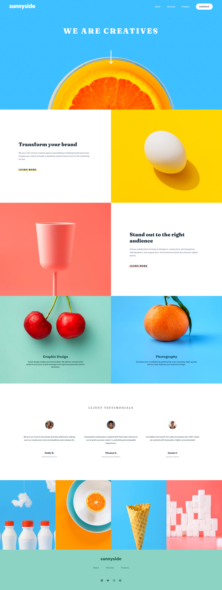

# Frontend Mentor - Sunnyside agency landing page solution

### The challenge

Users should be able to:

- View the optimal layout for the site depending on their device's screen size
- See hover states for all interactive elements on the page

### Screenshot

### Links

- Solution URL: [Github Repo](https://github.com/darshii98/sunny-landing-page)
- Live Site URL: [Github Pages](https://darshii98.github.io/sunny-landing-page/)

### Built with

- Sass
- Semantic HTML5 markup
- JS
- Flexbox
- CSS Grid

## Author

- Github- [darshii98](https://github.com/darshii98/)
- Frontend Mentor - [@darshii98](https://www.frontendmentor.io/profile/darshii98)
